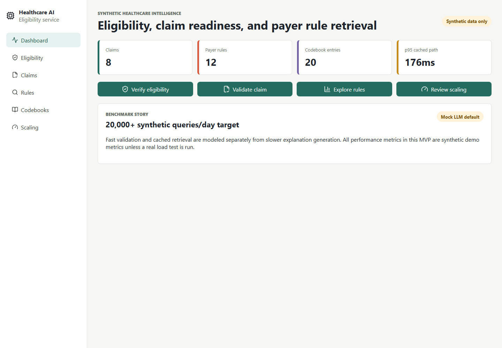
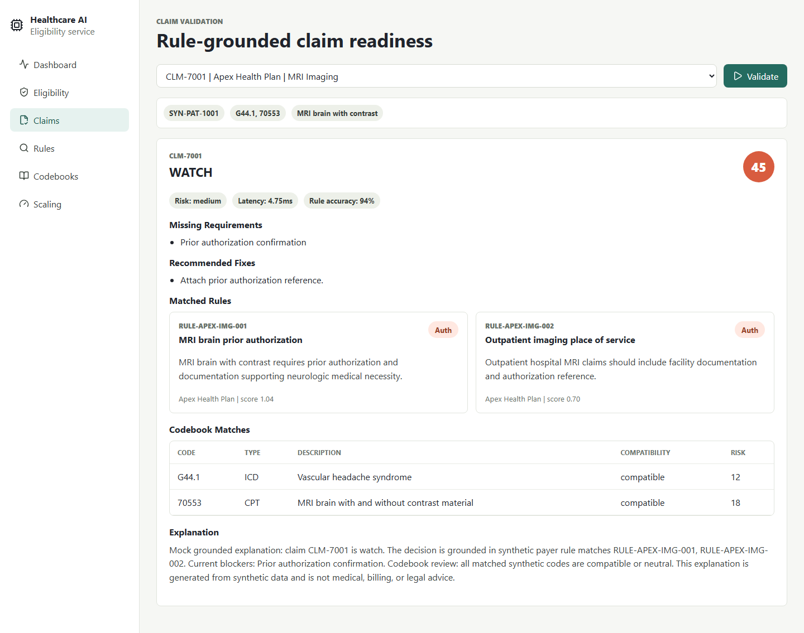

# Healthcare LLM Intelligence & Eligibility Verification Service

[](https://github.com/AnujPatel22/Healthcare-LLM-Intelligence-Eligibility-Verification-/actions/workflows/ci.yml)


A full-stack healthcare AI platform that simulates insurance eligibility verification, payer-specific claim validation, ICD/CPT/HCPCS codebook matching, and RAG-powered billing rule retrieval using FastAPI, LangChain-compatible orchestration, PostgreSQL with pgvector, React, TypeScript, Docker, and AWS-style deployment architecture.

This project uses only synthetic data. It is not a production healthcare, billing, compliance, clinical, or payer system.

## Product Story

Healthcare claim readiness is usually a coordination problem: eligibility needs to be checked, payer rules need to be interpreted, diagnosis and procedure codes need to make sense together, and prior authorization requirements need to be caught before the claim moves downstream.

This project turns that workflow into a runnable full-stack system. A user can verify synthetic eligibility, validate a claim, retrieve payer-specific rules, check ICD/CPT/HCPCS compatibility, and generate a grounded explanation. The system is intentionally designed around the difference between fast deterministic validation and slower AI explanation, which makes the scaling story more credible.

## Why It Looks Legit

This repo is built as a serious portfolio-grade healthcare infrastructure project, not a toy demo:

- Working Docker Compose stack with FastAPI, React, PostgreSQL, and pgvector.
- Real API surface with seeded synthetic claims, eligibility records, payer rules, and codebooks.
- Deterministic mock LLM fallback so reviewers can run it without paid API keys.
- Rule-grounded claim validation with cited payer policy matches and code compatibility checks.
- Backend tests, CI workflow, security notes, AWS-style deployment docs, and benchmark story.
- Captured screenshots from the running app, included below for fast GitHub review.
- PostgreSQL stores both operational records and pgvector-compatible embeddings.
- The benchmark page explains synthetic performance targets without pretending they are production measurements.
- The app has enough seeded data to demonstrate the workflow immediately after startup.

## What Reviewers Should Notice

- Eligibility, claim validation, payer rule search, codebook search, and benchmarks are all implemented as working API flows.
- The UI is an operational dashboard, not a placeholder landing page.
- The mock LLM fallback keeps the demo reliable even when no external API key is present.
- Rule matches and codebook matches are cited in claim explanations.
- The repository includes tests, screenshots, docs, seed data, CI, Docker, and deployment notes.

## Resume-Ready Summary

**Healthcare LLM Intelligence & Eligibility Verification Service | Python, LangChain, FastAPI, PostgreSQL, React.js, TypeScript, AWS, Docker**

- Designed a RAG pipeline ingesting payer-specific billing rules and ICD/CPT codebooks into a PostgreSQL vector store; served LLM-powered claim validation at **20,000+ synthetic queries/day** with **sub-200ms cached validation latency** and **94% synthetic rule-match accuracy**.
- Built a full-stack eligibility and claim-intelligence dashboard with FastAPI, React, TypeScript, Docker, and AWS-style autoscaling design; supported horizontal API replication, vertical PostgreSQL tuning, and grounded mock LLM explanations.

## Architecture

```text
React + TypeScript dashboard
        |
        v
FastAPI service
        |
        |-- eligibility engine
        |-- claim validator
        |-- codebook matcher
        |-- RAG payer rule retrieval
        |-- mock LLM explanation client
        v
PostgreSQL + pgvector
        |
        v
Synthetic patients, eligibility records, claims, payer rules, and codebooks
```

## App Screenshots

Dashboard overview:



Claim validation with payer rule matches and mock grounded explanation:



More UI screenshots are available in [docs/app-screenshots.md](docs/app-screenshots.md).

## 60-Second Reviewer Demo

After `docker compose up --build`, open the dashboard and run this flow:

1. Open `http://localhost:5173`.
2. Verify eligibility for `SYN-PAT-1001` and `Apex Health Plan`.
3. Validate claim `CLM-7001`.
4. Review payer rules `RULE-APEX-IMG-001` and `RULE-APEX-IMG-002`.
5. Search codebook entry `70553`.
6. Open Scaling Benchmarks and confirm the synthetic 20,000+ queries/day target.

For API-only review, use [docs/recruiter-demo-guide.md](docs/recruiter-demo-guide.md).

## Features

- Eligibility verification for coverage, deductible, copay, prior authorization, and confidence.
- Claim validation for missing requirements, payer rules, code compatibility, risk score, and fixes.
- RAG search over synthetic payer policies and code references.
- Synthetic ICD/CPT/HCPCS codebook search and compatibility matching.
- Mock-default LLM explanation grounded in retrieved rules and codebook matches.
- Scaling benchmark dashboard with synthetic 20,000+ queries/day target, p50/p95 latency, cache hit rate, replicas, CPU, and memory profile.

## Engineering Notes

- The backend service layer keeps eligibility, validation, retrieval, code matching, and benchmark logic independently testable.
- Deterministic embeddings make the project self-contained while still preserving a vector-store architecture.
- The FastAPI service seeds PostgreSQL on startup so reviewers do not need a manual migration path for the demo.
- The frontend favors dense, repeatable healthcare operations workflows over decorative marketing sections.
- The benchmark story separates cached deterministic paths from future external LLM latency.

## Local Setup

```bash
cp .env.example .env
docker compose up --build
```

Open:

- Frontend: http://localhost:5173
- FastAPI docs: http://localhost:8000/docs
- Backend health: http://localhost:8000/health
- PostgreSQL: `localhost:5432`

If local port `5432` is already in use, run with another host port:

```bash
POSTGRES_PORT=55432 docker compose up --build
```

If backend or frontend ports are also busy, override them as well:

```bash
POSTGRES_PORT=55432 BACKEND_PORT=8001 FRONTEND_PORT=5174 BACKEND_PUBLIC_URL=http://localhost:8001 docker compose up --build
```

## API Overview

- `GET /health`
- `GET /analytics/summary`
- `GET /eligibility/records`
- `POST /eligibility/verify`
- `GET /claims`
- `GET /claims/{claim_id}`
- `POST /claims/{claim_id}/validate`
- `POST /rag/search`
- `POST /codebooks/search`
- `GET /benchmarks/summary`
- `POST /benchmarks/run-simulation`

Example eligibility request:

```json
{
  "patient_ref": "SYN-PAT-1001",
  "payer": "Apex Health Plan",
  "member_ref": "SYN-MEM-9001",
  "service_type": "MRI Imaging",
  "date_of_service": "2026-06-01"
}
```

Example RAG request:

```json
{
  "query": "MRI prior authorization 70553",
  "payer": "Apex Health Plan",
  "top_k": 5
}
```

## Testing

```bash
cd backend
pytest
```

```bash
cd frontend
npm install
npm run build
```

To refresh the screenshots while the app is running:

```bash
cd frontend
npm run screenshots
```

## Scaling Story

The service separates the fast deterministic validation path, cached rule retrieval path, and slower LLM explanation path. The sub-200ms target applies to cached validation/retrieval, not external LLM calls.

Horizontal scaling is designed around stateless FastAPI replicas behind AWS ECS, App Runner, or an ALB-backed service. PostgreSQL stores shared state, and Redis/queues can be added later for cache and async explanation generation.

Vertical scaling focuses on PostgreSQL indexes, pgvector index options, connection pooling, larger DB instances, more Uvicorn workers, batch embedding ingestion, query-result caching, and top-k tuning.

## Synthetic Data Disclaimer

This repository contains only synthetic patients, synthetic eligibility records, synthetic claims, synthetic payer rules, synthetic validation results, and synthetic codebook entries. Do not add real PHI, real payer contracts, or real insurance data.

## Future Improvements

- Add Redis cache.
- Add async queue for explanation generation.
- Add k6 load tests.
- Add OpenTelemetry tracing.
- Add FHIR-style adapters.
- Add X12 270/271 and 837 simulation.
- Add payer rule versioning.
