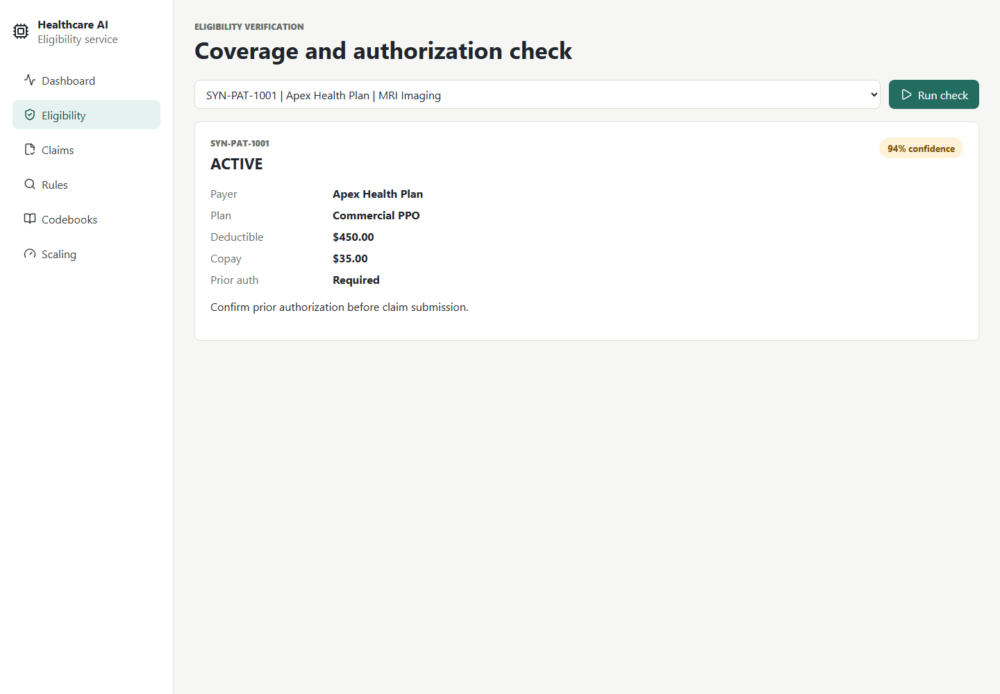
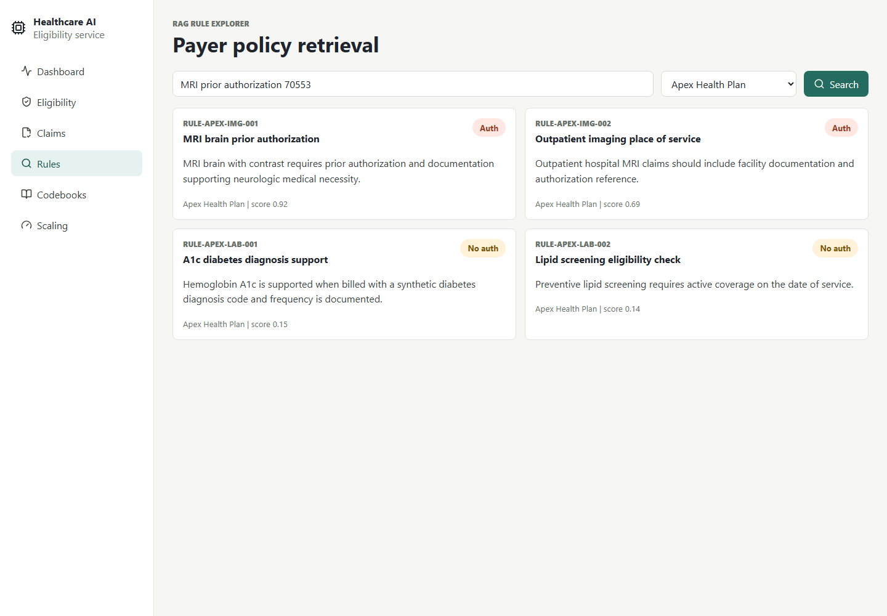
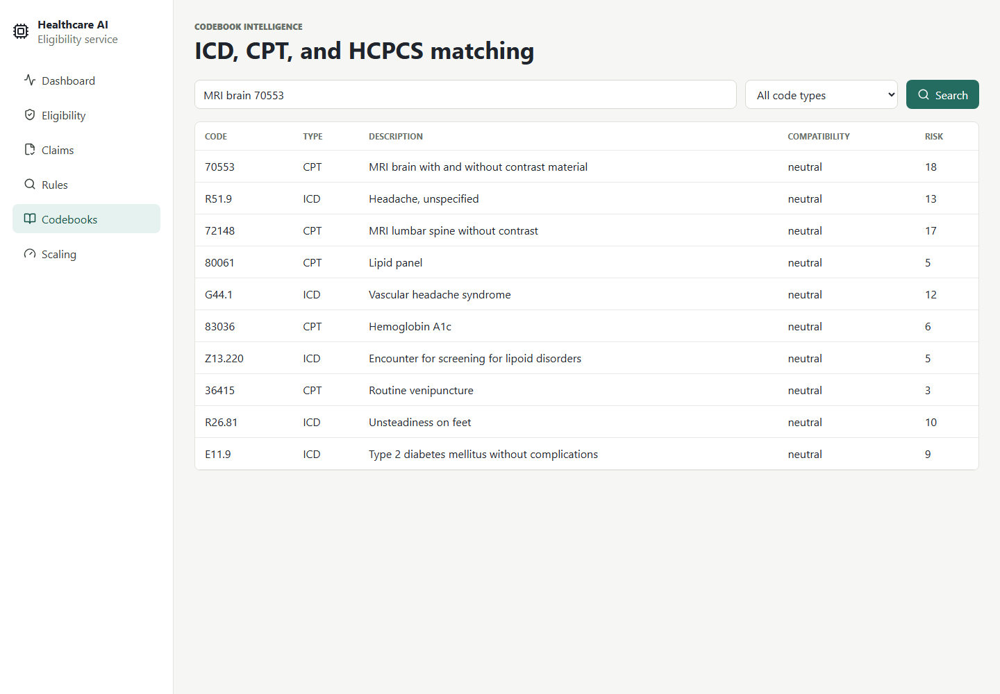
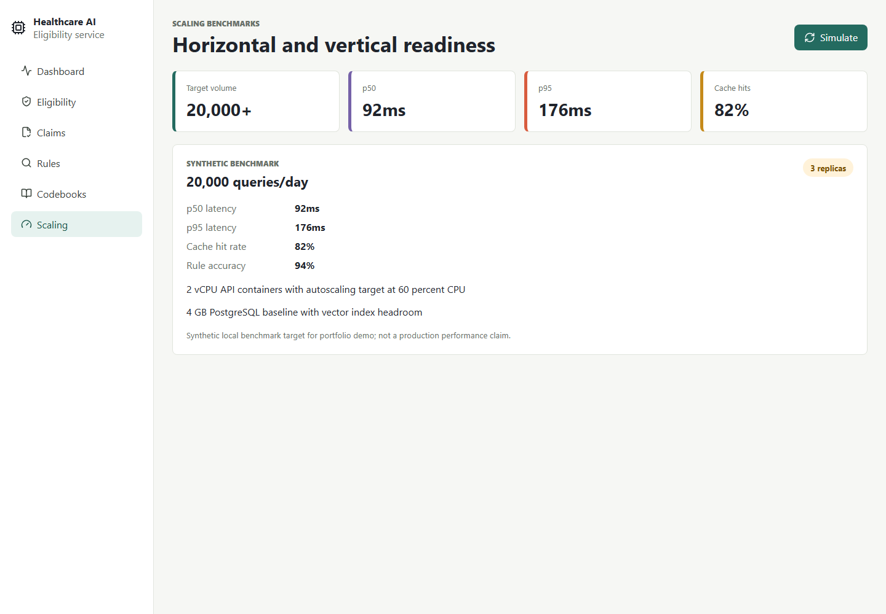

# App Screenshots

These screenshots were captured from the running local React app with Playwright. They show the real MVP UI backed by the FastAPI and PostgreSQL services.

## Dashboard


## Eligibility Verification



## Claim Validation


## Rule Explorer



## Codebook Search



## Scaling Benchmarks



## Refreshing Screenshots

Run the app, then execute:

```bash
cd frontend
npm run screenshots
```
